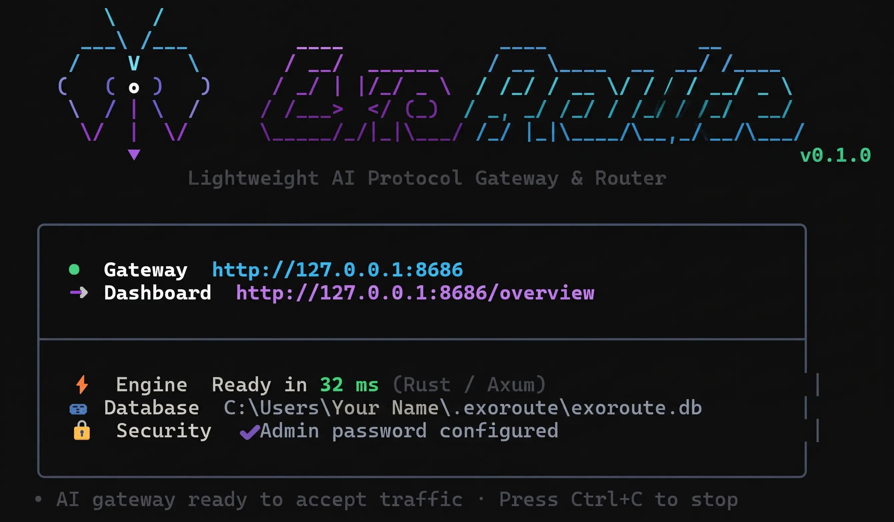

<p align="center">
  
</p>

<h1 align="center">ExoRoute</h1>

<p align="center">
  <strong>A local-first AI protocol gateway and model router built in Rust.</strong><br>
  Route requests across providers through OpenAI and Anthropic-compatible APIs.
</p>

<p align="center">
  
  
  
  
</p>

<p align="center">
  
</p>

---

## Overview


It provides your applications with a single HTTP endpoint (`127.0.0.1:8686/v1` by default), seamlessly converting across **OpenAI Chat Completions**, **OpenAI Responses**, and **Anthropic Messages** while routing requests intelligently across providers and models.

Open the built-in interactive documentation at `http://127.0.0.1:8686/docs` after starting ExoRoute for install, API, SDK, Cursor, Continue, Cline, and Roo Code integration guides.

---

## User Benefits

Why choose ExoRoute over heavy, multi-service alternatives?

* ⚡ **Rust gateway**: The repository includes a reproducible local-mock benchmark for measuring the gateway path on your own build and machine. Results depend on hardware, configuration, and workload; see [Performance measurement](#performance-measurement).
* 🔄 **Configurable Stream Resources**: Request bodies, SSE frames, replay journals, background continuity tasks, and provider concurrency have configurable limits. SSE frame and buffer limits, body-processing concurrency, and per-provider concurrency may use `0` for unlimited operation; continuity concurrency remains a bounded setting (1–64) because continuity tasks can run for up to 24 hours.
* 🛡️ **Combo Fallback Routing**: Chain provider models in priority or round-robin order. Server-side retries for bounded 5xx/transport failures happen before a gateway error is returned; ExoRoute still avoids retrying a stream after output has reached the client.
* 🔑 **Provider Key Rotation**: Rotate keys across requests and try another key when a provider explicitly rejects the current credential.
* 🌐 **Universal Protocol Translation**: Build your client against one preferred SDK (OpenAI Chat, OpenAI Responses, or Anthropic Claude) and talk to any backend model without rewriting your application code.
* 📦 **Zero Infrastructure Hassle (Single Native Binary)**: No Docker containers, Python runtimes, or external databases (Redis/PostgreSQL) required. ExoRoute uses an embedded LMDB environment and bundles a modern, high-speed Svelte 5 dashboard directly into a self-contained executable.
* 🔒 **Local-First Security & Egress Guard**: Binds only to loopback (`127.0.0.1` or `::1`) because the listener serves plain HTTP; remote access belongs behind a TLS reverse proxy connected to ExoRoute over loopback. ExoRoute enforces gateway API token authentication, encrypts stored provider secrets at rest with ChaCha20-Poly1305, and validates egress against SSRF.

---

## Performance measurement

The benchmark compares ExoRoute with a deterministic local mock provider; it does not measure a real AI provider or predict production latency. It exercises non-streaming OpenAI Chat Completions requests with a small response. Run it against a release build to get a report for your machine:

```sh
cargo build --release
python scripts/benchmark.py --binary target/release/exoroute --requests 800 --repeats 2 --concurrency 1,8 --output benchmark.json
```

On Windows, use `--binary target/release/exoroute.exe`. The script uses a temporary home and LMDB directory, starts a local mock provider, and removes its temporary data when it exits. Results vary with the machine and system load. The default admission limits are 64 concurrent gateway requests and 32 concurrent requests per provider; operational settings can change them, and zero disables those respective gates.

---

## Quick Install

### npm (Node.js 18+)
```sh
npm install -g exoroute
exoroute
```

The npm launcher downloads the matching ExoRoute release for Linux, macOS, or
Windows and verifies its SHA-256 checksum. It does not require Cosign.

### Linux & macOS
```sh
curl -fsSL https://raw.githubusercontent.com/nghiaomg/ExoRoute/main/install.sh | sh
```

### Windows (PowerShell)
```powershell
irm https://raw.githubusercontent.com/nghiaomg/ExoRoute/main/install.ps1 | iex
```

*The installer verifies signed checksum manifests with Sigstore Cosign before placing the binary in your PATH.*

---

## Getting Started

### 1. Launch the Gateway
```sh
exoroute
```
ExoRoute initializes `~/.exoroute/` (`%USERPROFILE%\.exoroute` on Windows), creates a starter `.env`, and serves the dashboard at `http://127.0.0.1:8686`. On an interactive terminal, it prints the generated initial admin password once; in non-interactive mode it prints the path where that password was stored instead.

On first run, securely retrieve the generated password from the terminal or the private `.env` file and change it when prompted in the dashboard. Gateway requests stay disabled until the required password change is complete. ExoRoute also generates `EXOROUTE_MASTER_KEY` and stores it in `.env`; keep that file private and preserve the key for as long as you need the database's encrypted provider credentials or backups.

For remote access, keep `EXOROUTE_HOST=127.0.0.1` and configure a TLS reverse proxy on the same host to forward requests to ExoRoute over loopback. ExoRoute rejects wildcard and non-loopback bind addresses because its listener serves plain HTTP.

### 2. Configure Providers & Combos
1. Open `http://127.0.0.1:8686` in your browser and log in.
2. Under **Providers**, add credentials for a supported provider (including NVIDIA NIM hosted at `https://integrate.api.nvidia.com/v1`) or link OpenAI Codex via browser OAuth. NIM model discovery is best-effort; if it does not return models, add the model ID manually. Its quota panel measures requests routed through this ExoRoute process over a rolling 60-second window; this is local RPM tracking, not NVIDIA account quota or a provider-reported limit.
   The OpenRouter preset imports namespaced model IDs such as `openrouter/anthropic/claude-...` and preserves suffixes such as `:free`. Per-key quota is read from OpenRouter's key-information endpoint and reports only the configured spending cap; it does not show account-wide credit balance or estimate separate limits for `:free` models.
   The Freebuff preset uses a Freebuff or CodeBuff Bearer auth token at `https://www.codebuff.com/api/v1`, imports its nine curated model IDs, and accepts manual passthrough model IDs. No Freebuff provider quota API has been verified, so ExoRoute does not report or track quota for it.
   The Antigravity preset connects Google accounts through browser OAuth, uses the `ag/` model prefix, and discovers Gemini, Claude, and supported open models through Google Cloud Code. Release builds include the upstream public desktop OAuth client, so users normally do not need to configure OAuth variables; `EXOROUTE_ANTIGRAVITY_OAUTH_CLIENT_ID` and `EXOROUTE_ANTIGRAVITY_OAUTH_CLIENT_SECRET` remain available as optional overrides. Its model and weekly quota snapshots come from the undocumented Cloud Code usage APIs when available; missing or stale upstream quota is shown as unavailable, and ExoRoute does not run a credit probe or create a local Antigravity quota meter.
3. Under **Combos**, create an alias (e.g. `coding-model`) pointing to one or more provider models, with ordered or round-robin fallback.
4. Under **API Keys**, generate a client API key.

### 3. Send Requests
Use standard OpenAI SDKs or `curl`:

```sh
curl http://127.0.0.1:8686/v1/chat/completions \
  -H "Authorization: Bearer YOUR_EXOROUTE_KEY" \
  -H "Content-Type: application/json" \
  -d '{
    "model": "coding-model",
    "messages": [{"role": "user", "content": "Explain Rust ownership in one sentence."}]
  }'
```

Supported endpoints include:
* `/v1/chat/completions` (OpenAI Chat format)
* `/v1/responses` (OpenAI Responses format)
* `/v1/messages` (Anthropic Claude format)
* `/v1/models` (List configured combo aliases and provider/model aliases)

### Images and vision

Image content in user messages can pass through the protocol converter as a public image URL or a base64 data URI when the selected upstream protocol and model support images. ExoRoute does not make a non-vision model vision-capable. Provider-scoped `file_id` image references are not supported; use a URL or data URI instead. The default gateway request-body limit is 16 MiB, including JSON and base64 image data.

### Output styles

Open **Settings → Output styles** to enable the prompt styles `terse-prose`, `less-code`, and `ponytail`. Each style supports `lite`, `full`, and `ultra`, and styles can be combined in catalog order. The feature is disabled by default, applies to new gateway requests globally, and persists as a versioned LMDB setting with an atomic revision. Static English instructions are added once to the system/developer context; provider responses are never rewritten and clients cannot override the setting per request.

The injector conservatively bypasses all styles for security or credential warnings, irreversible actions, explicit requests for detailed explanations, and ordered backup/migration/deploy/release sequences. The original request content, tools, media, metadata, and message order remain unchanged. Resetting the panel returns to the default disabled state immediately.

## Storage and backups

By default, ExoRoute keeps its `.env` file and LMDB environment under `~/.exoroute/` (`%USERPROFILE%\.exoroute` on Windows); the environment directory is `exoroute.lmdb`. Set `EXOROUTE_DATA_DIR` to move the application data directory or `EXOROUTE_DATABASE_PATH` to select a different LMDB environment directory. Relative paths resolve from the application's `.env` directory.

Keep the LMDB environment on a local filesystem and run only one ExoRoute process against it. Existing SQLite files are left untouched and are not read or migrated; SQLite backups are rejected. Use the dashboard's database export/import for ExoRoute `.exoroute` backup files. Backups never include active sessions or temporary stream state, and importing one requires signing in again. Restore the same `EXOROUTE_MASTER_KEY` before importing if the backup contains encrypted provider credentials.

### Optional stream continuity

In **Settings → Stream continuity**, enable the option and save. The setting is persisted and applied to new requests immediately. ExoRoute reserves the run before dispatching it, returns `x-exoroute-stream-id` immediately, and sends SSE keepalives while the provider is silent. If the client disconnects, a bounded worker continues consuming the upstream stream for up to 24 hours. Provider setup errors are sent as SSE `event: error` frames because the response has already started. Reconnect with the same gateway API key using `GET /v1/streams/{stream_id}` and `Last-Event-ID`, or explicitly stop the task with `DELETE /v1/streams/{stream_id}`.

Continuity recovers from client-side disconnects and retries bounded upstream 5xx/transport failures on the server before an error stream is emitted. It cannot retry after upstream output has reached the client or survive a gateway process restart. The dashboard configures 1–64 continuity tasks concurrently (default 16). Replay is retained for one day, up to 8 MiB per run and 128 MiB total; reaching a replay limit does not stop the active task, but the missing events can no longer be resumed. When all task slots are occupied or the replay run cannot be reserved, ExoRoute rejects the request before sending it to a provider.

---

## Architecture Highlights

```
                      ┌─────────────────────────────────────────┐
                      │              Client (SDK / App)         │
                      └────────────────────┬────────────────────┘
                                           │ HTTP / SSE
                                           ▼
                      ┌─────────────────────────────────────────┐
                      │          ExoRoute Core Gateway          │
                      │  - HTTP listener (loopback by default)  │
                      │  - Strict Bounded Memory Queues         │
                      │  - Automatic RAII Resource Reclamation  │
                      │  - Universal Protocol Normalizer        │
                      └──────┬───────────────────┬──────────────┘
                             │                   │
                [Combo & Key Selection]  [Health Check & Failover]
                             │                   │
             ┌───────────────┴──────────┐        │
             ▼                          ▼        ▼
┌─────────────────────────┐   ┌─────────────────────────┐
│ Upstream Provider 1     │   │ Upstream Provider 2     │
│ (e.g. OpenAI / Claude)  │   │ (Fallback / Alternate)  │
└─────────────────────────┘   └─────────────────────────┘
```

* **Bounded Request Processing**: Gateway request bodies and upstream response streams are subject to configured size and concurrency limits.
* **Controlled Stream Lifetime**: Without continuity, disconnecting the client cancels the response stream. With continuity enabled, the bounded worker remains responsible for the upstream response until it finishes, the user cancels it, or the 24-hour upstream deadline is reached.
* **Integrated Observability**: Inspect real-time request latencies, HTTP status telemetry, and active providers straight from the built-in Command Center dashboard.

---

## Building from Source

Prerequisites: Rust toolchain 1.88 or newer, Python 3.10+ for the optional benchmark, and Node.js with npm.

```sh
# 1. Build dashboard assets
cd web
npm ci
npm run build
cd ..

# 2. Build and run native release executable
cargo run --release
```

To run test suites:
```sh
cargo test
```

---

## License

Licensed under the [MIT License](LICENSE).
